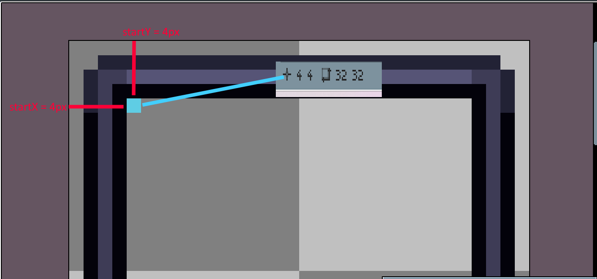
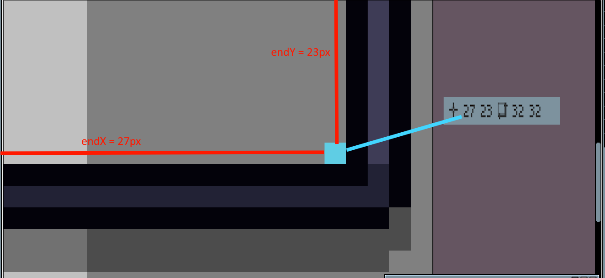

# Custom NPC Paintings

https://www.nexusmods.com/stardewvalley/mods/26228

## How to add backgrounds and frames

**Backgrounds**

1. [Without Content Patcher](#without-content-patcher)
1. [With Content Patcher](#with-content-patcher)

**Frames**

1. [With Content Patcher](#frames)


### Backgrounds


Backgrounds can be any size and do not have to fit the tile size of Stardew Valley. However, the background must fit in atleast one single frame. Also, please don't super large images. It might mess up the UI.

#### Without Content Patcher

This method is recommended if you don't plan to release a content pack for Custom NPC Paintings.

1. Locate your mods folder (...steamapps/common/Stardew Valley/Mods)
1. Go to CustomNPCPaintings
1. Go to assets/backgrounds
1. Place your image file (only png) in the folder. The name of your file will be the display name


This image was actually added by accident to 1.0.1. I tested this method and forgot to remove it.

#### With Content Patcher

Using Content Patcher allows you to easily create and publish a Content Pack for Custom NPC Paintings. This method is recommended if you want to upload and share your assets.

Before we start, I assume you know the basics of Content Patcher because I haven't really worked much with CP yet. If you want to learn CP, [heres](https://github.com/Pathoschild/StardewMods/blob/develop/ContentPatcher/docs/author-guide.md) a guide.

1. Create a new Project and add ```AvalonMFX.CustomNPCPaintings``` to your dependencies in your manifest
```json
  "Dependencies": [
    {
      "UniqueID": "AvalonMFX.CustomNPCPaintings",
      "isRequired": true
    }
  ]
```
2. In your ```content.json``` (or optionally other files), add a new change with Action ```"EditData"``` and target ```"AvalonMFX.CustomNPCPaintings/Backgrounds"```
1. Add a new Entry. The key will be a unique key for your background.
```json
"Entries": {
    "{{ModId}}_CloudySky": { //Unique Key of your Background. Use the ModId constant to avoid collisions
        "textureName": "Backgrounds/Cloudy_Sky",
        "displayName": "Cloudy Sky" // you can also do {{i18n: backgrounds.cloudy_sky} for translations. Make sure to read pathos guide for that
    }
```
4. Now, lets load the texture. Add a new Change with the Action ```"Load"```.
1. The target will be your asset name for your image
1. Use ```"FromFile"``` and specify the path of your texture
```json
{
    "Action": "Load",
    "Target": "Backgrounds/Cloudy_Sky", //this must be equal to the textureName value of your background
    "FromFile": "assets/Cloudy_Sky.png"
}
```

Your ```content.json``` file should look like this now
```json
{
  "Format": "2.0.0", //make sure to use the latest version
  "Changes": [
    {
      "Action": "EditData",
      "Target": "AvalonMFX.CustomNPCPaintings/Backgrounds",
      "Entries": {
        "{{ModId}}_CloudySky": { //Unique Key of your Background to avoid collisions. Use the ModId constant to avoid collisions
          "textureName": "{{ModId}}/Backgrounds/Cloudy_Sky", 
          "displayName": "Cloudy Sky" // you can also do {{i18n: backgrounds.cloudy_sky} for translations. Make sure to read pathos guide for that
        }
      }
    },
    {
      "Action": "Load",
      "Target": "{{ModId}}/Backgrounds/Cloudy_Sky", //this must be equal to the textureName value of your background. Use the ModId constant to avoid collisions
      "FromFile": "assets/Cloudy_Sky.png"
    }
  ]
}
```

And there you go! If you want to add more backgrounds, just add them to ```"Entries"``` and add a new load action for the texture. Although I lack of CP knowledge, I hope the guide was understandable. If there's an easier way our you have improvements, please let me know.

### Frames

Frames can currently only be added using Content Patcher.

1. Create a new Project and add ```AvalonMFX.CustomNPCPaintings``` to your dependencies in your manifest
```json
  "Dependencies": [
    {
      "UniqueID": "AvalonMFX.CustomNPCPaintings",
      "isRequired": true
    }
  ]
```
2. In your ```content.json``` (or optionally other files), add a new change with Action ```"EditData"``` and target ```"AvalonMFX.CustomNPCPaintings/Frames"```
1. Add a new Entry. The key will be a unique key for your background.
```json
"Entries": {
    "{{ModId}}_DarkFrame": { //Unique Key of your Frame. Use the ModId constant to avoid collisions
        "startX": 4, //the X position of when the background should start to draw - I will add an image below that explains it easily
        "startY": 5, //the Y position of 
        "endX": 27, //the X position of when the background should stop drawing
        "endY": 23, //the Y position of when the background should stop drawing
        "textureName": "{{ModId}}/Frames/Dark_Frame",
        "displayName": "Dark Frame" // you can also do {{i18n: frames.dark_frame} for translations. Make sure to read pathos guide for that
    }
```


(Note you have to start "counting" from the left and top of the **canvas** size. The easiest way is to hover over the start and end with a 1px pen. It will display your x and y coordinate)

4. Now, lets load the texture. Add a new Change with the Action ```"Load"```.
1. The target will be your asset name for your image
1. Use ```"FromFile"``` and specify the path of your texture
```json
{
    "Action": "Load",
    "Target": "{{ModId}}/Frames/Dark_Frame", //this must be equal to the textureName value of your background. Use the modId constant to avoid collisions
    "FromFile": "assets/Dark_Frame.png"
}
```
7. Your ```content.json``` file should look like this now
```json
{
  "Format": "2.0.0", //make sure to use the latest version
  "Changes": [
    {
      "Action": "EditData",
      "Target": "AvalonMFX.CustomNPCPaintings/Frames",
      "Entries": {
        "{{ModId}}_DarkFrame": { //Unique Key of your Background to avoid collisions. Use the ModId constant to avoid collisions
            "startX": 4, //the X position of when the background should start to draw - I will add an image below that explains it easily
            "startY": 5, //the Y position of 
            "endX": 27, //the X position of when the background should stop drawing
            "endY": 23, //the Y position of when the background should stop drawing
            "textureName": "{{ModId}}/Frames/Dark_Frame",
            "displayName": "Dark Frame" // you can also do {{i18n: frames.dark_frame} for translations. Make sure to read pathos guide for that
        }
      }
    },
    {
      "Action": "Load",
      "Target": "{{ModId}}/Frames/Dark_Frame", //this must be equal to the textureName value of your background. Use the ModId constant to avoid collisions
      "FromFile": "assets/Dark_Frame.png"
    }
  ]
}
```

And there you go! If you want to add more frames, just add them to ```"Entries"``` and add a new load action for the texture. Although I lack of CP knowledge, I hope the guide was understandable. If there's an easier way our you have improvements, please let me know.

If you want to see more examples, check the out [default content pack](https://github.com/1Avalon/Avas-Stardew-Mods/blob/main/CustomNPCPaintings/%5BCP%5D%20Custom%20NPC%20Paintings/content.json).